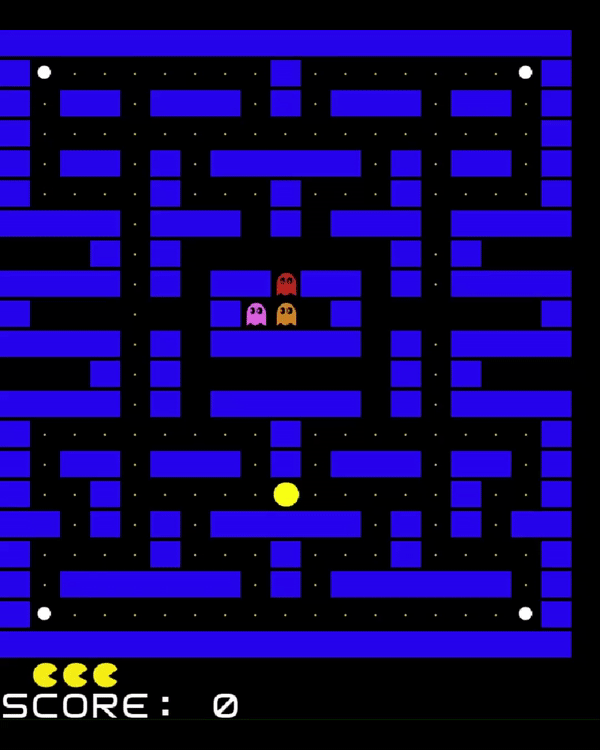

## LDTS_2L.EIC04-03 - PAC-MAN

### Game Description
> In this thrilling recreation of the classic arcade game, you will be tasked with navigating a maze and eating all the Pac-dots while avoiding the infamous ghosts  Blinky, Pinky, Inky, and Clyde.
If one of the ghosts catches you, you will lose a life unless you've eaten a power pellet, in which case you can eat the ghosts for bonus points. If you lose all your three lives, it's game over.
You can also play with your friend in a 2-player mode, where one of you will live in the shoes of Pac-Man and the other will be a ghost.

  

> The keyboard controls are:
>- Up/Down/Left/Right: moving in the menu and moving the pacman
>- W/A/S/D: moving for the monster player
>- Enter: selecting a menu option
>- Q: going back (in game and in menu)

This project was developed by *Adriano Machado* (*up202105352*@fe.up.pt), *Félix Martins* (*up202108837*@fe.up.pt) and *Tomás Pereira* (*up202108845*@fe.up.pt) for LDTS course of 2022⁄23.

For a more detailed versin of this description, click [here](./docs/README.md).
### IMPLEMENTED FEATURES
>- **Connected Menus** - Browsing back and forth through different Menus
>- **Main Menu** to browse to different menus and to choose whether to play single or multiplayer
>- **Menu** to choose the level to play
>- **Menu** to see the best scores
>- **Sound** - many actions produce sounds. Ex: moving through menus, starting the game, pacman eating coins/hitting monsters
>- **Player movement** - moves in direction given by input and keeps moving until reaches wall or receives input
>- **Monster movement** - monster move according to different algorithms
>- **Multiplayer** - additional monster player with movement similar to pacman 
>- **Pacman collects coins** - score increases when he collects one
>- **Pacman collides with monsters** - health decreased and positions of monsters and pacman reset to beginning
>- **PowerUps** for pacman - makes ghosts "scared" and is able to eat them on collision for points
>- **Loading map from file** - map is loaded from file thus allowing different maps to be used
>- **Resetting map** - after pacman collects all coins of the map, the coins and powerUps get reset back to how they were in the start of the level

  
  

  <b><i>Gif 1. Single Player Game</i></b>
    &ensp;&ensp;&ensp;&ensp;&ensp;&ensp;&ensp;&ensp;&ensp;&ensp;&ensp;
    &ensp;&ensp;&ensp;&ensp;&ensp;&ensp;&ensp;&ensp;&ensp;&ensp;&ensp;
    &ensp;&ensp;&ensp;&ensp;&ensp;&ensp;&ensp;&ensp;&ensp;
  <b><i>Gif 2. Multiplayer Game</i></b>

  
  
  

  <b><i>Gif 3. Main Menu</i></b>
    &ensp;&ensp;&ensp;&ensp;&ensp;&ensp;&ensp;&ensp;&ensp;&ensp;&ensp;
    &ensp;&ensp;&ensp;&ensp;&ensp;&ensp;&ensp;
  <b><i>Gif 4. Choose Level</i></b>
    &ensp;&ensp;&ensp;&ensp;&ensp;&ensp;&ensp;&ensp;&ensp;&ensp;&ensp;
    &ensp;&ensp;&ensp;&ensp;&ensp;&ensp;
  <b><i>Fig 1. Scores</i></b>

