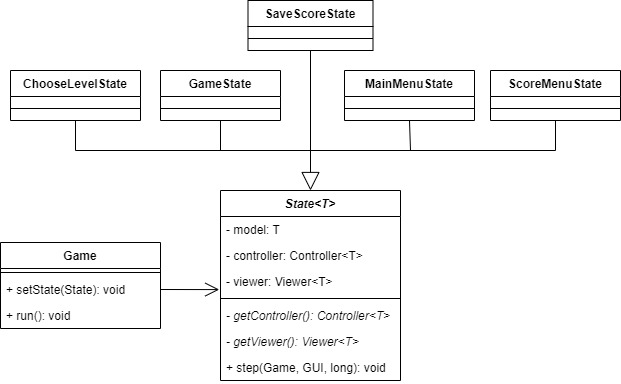

# LDTS_2L.EIC04-03 - PAC-MAN

## Game Description
> In this thrilling recreation of the classic arcade game, you will be tasked with navigating a maze and eating all the Pac-dots while avoiding the infamous ghosts  Blinky, Pinky, Inky, and Clyde.
If one of the ghosts catches you, you will lose a life unless you've eaten a power pellet, in which case you can eat the ghosts for bonus points. If you lose all your three lives, it's game over.
You'll also be able to play with your friend in a 2-player mode, where one of you will live in the shoes of Pac-Man and the other will be a ghost.

  

> The keyboard controls are:
>- Up/Down/Left/Right: moving in the menu and moving the pacman
>- W/A/S/D: moving for the monster player
>- Enter: selecting a menu option
>- Q: going back (in game and in menu)

This project was developed by *Adriano Machado* (*up202105352*@fe.up.pt), *Félix Martins* (*up202108837*@fe.up.pt) and *Tomás Pereira* (*up202108845*@fe.up.pt) for LDTS 2022⁄23.

## IMPLEMENTED FEATURES
>- **Connected Menus** - Browsing back and forth through different Menus
>- **Main Menu** to browse to different menus and to choose whether to play single or multiplayer
>- **Menu** to choose the level to play
>- **Menu** to see the best scores
>- **Sound** - many actions produce sounds. Ex: moving through menus, starting the game, pacman eating coins/hitting monsters
>- **Player movement** - moves in direction given by input and keeps moving until reaches wall or receives input
>- **Monster movement** - monster move according to different algorithms
>- **Multiplayer** - additional monster player with movement similar to pacman
>- **Pacman collects coins** - score increases when he collects one
>- **Pacman collides with monsters** - health decreased and positions of monsters and pacman reset to beginning
>- **PowerUps** for pacman - makes ghosts "scared" and is able to eat them on collision for points
>- **Loading map from file** - map is loaded from file thus allowing different maps to be used
>- **Resetting map** - after pacman collects all coins of the map, the coins and powerUps get reset back to how they were in the start of the level

## DESIGN

>> ### GUI
>>**Problem in Context**\
>>Using Lanterna directly as a way of drawing in all of our Viewer Classes would make for a direct violation of the DIP.
>>In fact, a lot of our classes would depend on Lanterna. Changing that external library would be difficult (or just updating it): changes would have to be made across several classes.
>> 
>>**The Pattern**\
>>We used the **Adapter** pattern. Using a GUI interface with the methods used by our classes allows less frequent changes in general classes and avoids direct dependency across them with Lanterna.
>>In the case that we would change the external library, all that would be needed is to implement the GUI interface in a new class and pass that derived class to our classes.
>>
>>**Implementation**
>> 
>>
>>
>> These classes can be found in the following links:
>> - [GUI](../src/main/java/ldts/pacman/gui/GUI.java)
>> - [LanternaGUI](../src/main/java/ldts/pacman/gui/LanternaGUI.java)
>>
>> The client in the picture is a denotation for all the classes that use the GUI (mostly Viewer classes)
>> 
>>**Consequences**\
>>Promotes replaceability (in this case, of Lanterna with another external library to draw things) and promotes SRP, since only the LanternaGUI is concerned with how exactly to draw things with Lanterna and not each of the Viewers (e.g. the viewers don't have to be concerned with the existence of a screen or TextGraphics)

>> ### Monster States
>>**Problem in Context**\
>>Monsters can have different behaviours, including different ways of moving, and the controller and the viewer need to know how to treat and move them.
>> There is the possibility of using a switch-case and determining their behaviour that way, depending on flags in monster. 
>> However, that disrespects the OCP and is definitely not a good solution.
>>
>>**The Pattern**\
>>We have used the **State** pattern to define the state/behaviour of the monsters.
>> In fact, the [Monster](../src/main/java/ldts/pacman/model/game/elements/monsters/Monster.java) abstract class has a MonsterState field that can be changed throughout the game, and can be accessed by the controller and the viewer.
>> Different monster states have different ways of moving and different drawing characters, meaning different ways of drawing them.
>> The states can change the monster state themselves, or they could be changed by an outside entity, such as the PacmanController when Pacman collects a powerUp.
>>
>>**Implementation**
>>
>> The UML class diagram for the MonsterStates is presented here:
>>
>>  
>>
>> The UML state diagram for the MonsterStates is presented here:
>>
>>  
>>
>> These classes can be found in the following links:
>> - [Monster](../src/main/java/ldts/pacman/model/game/elements/monsters/Monster.java)
>> - [MonsterState](../src/main/java/ldts/pacman/controller/game/monster/state/MonsterState.java)
>> - [ScatterState](../src/main/java/ldts/pacman/controller/game/monster/state/ScatterState.java)
>> - [ChaseState](../src/main/java/ldts/pacman/controller/game/monster/state/ChaseState.java)
>> - [EatenState](../src/main/java/ldts/pacman/controller/game/monster/state/EatenState.java)
>> - [ScaredState](../src/main/java/ldts/pacman/controller/game/monster/state/ScaredState.java)
>>
>>**Consequences**\
>> This pattern allows us to change the monster behaviour (state) during runtime, and we've avoided scattered conditional logic.
>> Another benefit is making these state transitions explicit in the code.

>>### Factory method
>>**Problem in Context**\
>> Parent abstract classes sometimes can't define the class of objects that they should create.
>> It must be specified only by the subclasses.
>> An example of this is the [MonsterState](../src/main/java/ldts/pacman/controller/game/monster/state/MonsterState.java).
>>
>>**The Pattern**
>>We've used the Factory method several times in our code.
>> In this example, the abstract class MonsterState knows it has to define a way to move (an abstract MovementStrategy).
>> It does not know, however, which concrete implementation to return. By using this pattern, we delegate the choice of the MovementStrategy to the subclasses of MonsterState.
>> Only those will (know to) specify the concrete specification (e.g. ScaredState defines ScaredStrategy)
>>
>>**Implementation**
>> 
>>
>> 
>> These classes can be found in the following links:
>> - [MonsterState](../src/main/java/ldts/pacman/controller/game/monster/state/MonsterState.java)
>> - [ScaredState](../src/main/java/ldts/pacman/controller/game/monster/state/ScaredState.java)
>> - [ScatterState](../src/main/java/ldts/pacman/controller/game/monster/state/ScatterState.java)
>> - [ChaseState](../src/main/java/ldts/pacman/controller/game/monster/state/ChaseState.java)
>> - [MovementStrategy](../src/main/java/ldts/pacman/controller/game/movement/strategy/MovementStrategy.java)
>> - [ScaredStrategy](../src/main/java/ldts/pacman/controller/game/movement/strategy/bot/ScaredStrategy.java)
>> - [ChasePacmanStrategy](../src/main/java/ldts/pacman/controller/game/movement/strategy/bot/target/ChasePacmanStrategy.java)
>> - [ScatterCornerStrategy](../src/main/java/ldts/pacman/controller/game/movement/strategy/bot/target/ScatterCornerStrategy.java)
>> - [EatenStrategy](../src/main/java/ldts/pacman/controller/game/movement/strategy/bot/target/EatenStrategy.java)
>>
>>**Consequences**
>> By using this pattern, we delegate the algorithm choice for the movement to the concrete MonsterStates, that know which to define.
>> When asked to move a monster, the MonsterState can easily ask its MovementStrategy to do so.
>> This avoids any switch cases by using polymorphism.

>>### Strategy
>>**Problem in Context**\
>>There are different ways of moving and a movable object might share his movement algorithm with another object.
>> That would make for code cloning.
>>
>>**The Pattern**\
>>We used the **Strategy** pattern. There exist some strategies that define the way the entities can move.
>> A given entity must only identify as moving with that algorithm and not define it.
>>**Implementation**
>> 
>>  
>> 
>> These classes can be found in the following links:
>> - [MonsterState](../src/main/java/ldts/pacman/controller/game/monster/state/MonsterState.java)
>> - [PlayerMovementStrategy](../src/main/java/ldts/pacman/controller/game/movement/strategy/player/PlayerMovementStrategy.java)
>> - [PacmanPlayerStrategy](../src/main/java/ldts/pacman/controller/game/movement/strategy/player/PacmanPlayerStrategy.java)
>> - [MonsterPlayerStrategy](../src/main/java/ldts/pacman/controller/game/movement/strategy/player/MonsterPlayerStrategy.java)
>> - [BotStrategy](../src/main/java/ldts/pacman/controller/game/movement/strategy/bot/BotStrategy.java)
>> - [ScaredStrategy](../src/main/java/ldts/pacman/controller/game/movement/strategy/bot/ScaredStrategy.java)
>> - [TargetStrategy](../src/main/java/ldts/pacman/controller/game/movement/strategy/bot/target/TargetStrategy.java)
>> - [ScatterCornerStrategy](../src/main/java/ldts/pacman/controller/game/movement/strategy/bot/target/ScatterCornerStrategy.java)
>> - [EatenStrategy](../src/main/java/ldts/pacman/controller/game/movement/strategy/bot/target/EatenStrategy.java)
>> - [ChasePacmanStrategy](../src/main/java/ldts/pacman/controller/game/movement/strategy/bot/target/ChasePacmanStrategy.java)
>>
>>**Consequences**\
>>As such, we've avoided having to duplicate code due to multiple entities having the same movement algorithm.
>> It allows us to pass it to a movable object, and it will behave accordingly.

>>### MVC
>>**Problem in Context**\
>>In defining a class with its data, behaviour (movement) and way of drawing itself, we would be neglecting the **Single Responsibility Principle**.
>>That class would have too many responsibilities and there would be many reasons for it to change.
>>
>>**The Pattern**\
>>We've used the **Model-View-Control** architectural pattern, more specifically HMVC (MVC for each component).
>> This defines a model with the data for the entity, a controller which manipulates that data and a Viewer to display the data.
>>
>>**Implementation**\
>> This image represents an example of the usage of MVC.
>>
>>  
>> 
>> An example of the application of this pattern can be found in the following links:
>> - [PacmanController](../src/main/java/ldts/pacman/controller/game/PacmanController.java)
>> - [PacmanViewer](../src/main/java/ldts/pacman/view/game/PacmanViewer.java)
>> - [Pacman](../src/main/java/ldts/pacman/model/game/elements/Pacman.java)
>>
>>**Consequences**\
>>By using this pattern, we've delegated each responsibility to each class, now respecting the SRP.
>> There will only be one reason for each class to change.

>>### Application state
>>**Problem in Context**\
>> To define application state/behaviour, a possible but bad solution would be to have multiple flags for the states in the Game and use a switch-case statement.
>>Any controller (controls movement of entities) could modify those flags which would make the game/application change behaviour.
>> This is a direct violation of the OCP.
>>
>>**The Pattern**\
>>We used the **State** Pattern to modify behaviour according to the state.
>>This pattern allows us to represent different states with different subclasses.
>>We can switch to a different state of the "game" by switching to another implementation (another subclass of State).
>>Our game (main class) has a state and any controller can modify it. The state represents what's going on in the application.
>>This pattern allows us to avoid the scattered conditional logic by using polymorphism.
>>In the classes below, there's also present the usage of a FactoryMethod, allowing the subclasses of State to denote their controller and viewer of choice.
>> This will allow them to pass input from the user to their controller.
>>
>>**Implementation**
>> 
>>  
>>
>>  These classes can be found in the following links:
>> - [Game](../src/main/java/ldts/pacman/Game.java)
>> - [State](../src/main/java/ldts/pacman/application/state/State.java)
>> - [GameState](../src/main/java/ldts/pacman/application/state/GameState.java)
>> - [MainMenuState](../src/main/java/ldts/pacman/application/state/menu/MainMenuState.java)
>> - [ChooseLevelState](../src/main/java/ldts/pacman/application/state/menu/ChooseLevelState.java)
>> - [SaveScoreState](../src/main/java/ldts/pacman/application/state/menu/SaveScoreState.java)
>> - [ScoreMenuState](../src/main/java/ldts/pacman/application/state/menu/ScoreMenuState.java)
>>
>>**Consequences**\
>>Using this pattern makes existing states explicit and easier to comprehend.
>>There's no need for conditional statements in relation to application state, used polymorphism instead.
>>Passing input to the controllers is now done by states using the factory method.

>>### Sound
>>Even though we were using the Observer patter for the Sound (as discussed in the presentation), we decided it was not the best option.
>>We also felt that we were forcing a not needed pattern, so we removed it.

### KNOWN CODE SMELLS AND REFACTORING SUGGESTIONS

#### Large classes

Some of our classes contain a lot of methods (GUI interface and LanternaGUI) and others a lot of fields (Arena).
In both of these cases, we judged it acceptable since these classes require them to fulfill their responsibility.
However, to solve this, for example, for the GUI, it could be split into two (or multiple interfaces), each one having some methods.
It doesn't seem crucial here.

#### Long Parameter List (and Data Clumps)
These code smells are present in the constructor of [Arena](../src/main/java/ldts/pacman/model/game/arena/Arena.java) and the createArena method in [ArenaLoader](../src/main/java/ldts/pacman/model/game/arena/ArenaLoader.java).
These sound parameters are passed for dependency injection, so tests can mock them and verify method calls (and not produce sound while testing).
A solution would be to bundle the SoundObservers given to Arena in an object.
In fact, it would be a good solution, since the two examples given contain a repeating group of parameters (data clump).

Another example of this code smell is on the [PlayerMovementStrategy](../src/main/java/ldts/pacman/controller/game/movement/strategy/player/PlayerMovementStrategy.java), in which we have 4 options that convert to directions.
This is done mainly for readability purposes, but could also be solved in the same way as the other example.

#### Feature envy (and message chaining)
Due to the usage of the **MVC** architectural pattern, a lot of our controllers mainly access their models' "features".
The same happens in our viewers classes, which access the model's data to draw it.
Since they have to request to access their model's data, this also generates message chaining.

Some examples of this are the MainMenuController or PacmanController, that access and modify the data of their models.

Since this is a direct consequence of the MVC pattern, we didn't see the benefits of changing it.
Also, by separating these features across the model, controller and viewer, we're appealing to the SRP (Single responsibility principle).
However, generally this code smell could be "fixed" by moving features across objects (e.g. from the model to the controller)

#### Refused Bequest
While trying to generalize code, we couldn't avoid this code smell. We created abstract classes such as MonsterState, so their children could all be treated the same.
However, not all the subclasses needed/wanted to define all of their parent's methods. This is the definition of refused bequest.
Another example of this smell are the parameters given to methods which do not use them.
Examples of this smell in our code are:
- [ScoreMenuController](../src/main/java/ldts/pacman/controller/menu/ScoreMenuController.java) doesn't use its model;
- Some methods in [EatenState](../src/main/java/ldts/pacman/controller/game/monster/state/EatenState.java) that we've defined to do nothing (getHit and setStrategy) so we could treat this state as just another Monster State
- [MovementStrategy](../src/main/java/ldts/pacman/controller/game/movement/strategy/MovementStrategy.java)'s 
move method receives options as a parameter, but only the [PlayerMovementStrategy](../src/main/java/ldts/pacman/controller/game/movement/strategy/player/PlayerMovementStrategy.java)
classes use them.
This is done, so we can, in [MonsterController](../src/main/java/ldts/pacman/controller/game/MonsterController.java)
and [MonsterState](../src/main/java/ldts/pacman/controller/game/monster/state/MonsterState.java), 
treat all monsters the same way. Only the MonsterPlayer will have a PlayerMovementStrategy strategy, but this will allow us to treat all the monsters the same way.

A solution for this would be splitting the "interfaces" of said classes.
In the first two examples, this does not seem necessary since they are exceptions to the rule.
In the last example, we opted not to avoid this smell in order to treat the monsters, including MonsterPlayer, the same way.

#### Data classes
Since we've used the MVC architectural pattern, it is natural that some of our classes only contain data (fields and methods to access them) and don't have much behaviour.
Some examples of this code smell are the [Element](../src/main/java/ldts/pacman/model/game/elements)
derived classes, such as abstract MovableElement and classes Pacman, Coin, PowerUp and Wall.
It is also present in some [Menu](../src/main/java/ldts/pacman/model/menu)
model classes: MainMenu, SaveScore and ChooseLevel.
We did not consider this a bad code smell, since it directly originates from the usage of the MVC pattern.

## TESTING
### Coverage Report

  

-[Mutation testing report](https://adriano-7.github.io/)

## SELF-EVALUATION

- Adriano Machado: %
- Félix Martins: %
- Tomás Pereira: %
